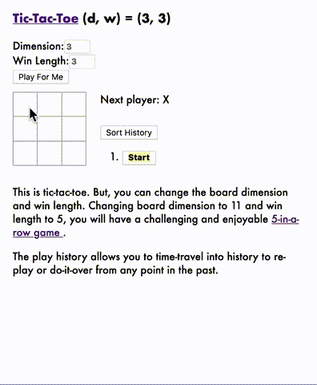

# react-generalized-tic-tac-toe

Play this tic-tac-toe game [here](https://powerful-cove-23499.herokuapp.com/).  This game was built by following the [Tutorial: Intro to React](https://reactjs.org/tutorial/tutorial.html).


## Features

In addition to implementing the six improvements suggested by the tutorial, it has the following features:

1. Generalized to n dimension where n = 1, 2, ..., 25 controlled by the user.  The upper limit of 25 is arbitrary.

2. User can enter the win length. For example, entering win length 5 and board dimension 11 will result in a five-in-a-roll game.

3. The current play is bolded.

4. It highlights all winning lines if there is more than one winning line.


## Build & Run

After cloning the repository at a command-line terminal, go to the home directory then enter command:

```
npm start
```

Hit [localhost:3000](http://localhost:3000/) to play the game if your browser didn't open the game.


## Five-In-A-Roll Game Demo


## Tic-Tac-Toe Demo




## Future Enhancements

To allow to play against the computer's artificial intelligence.
